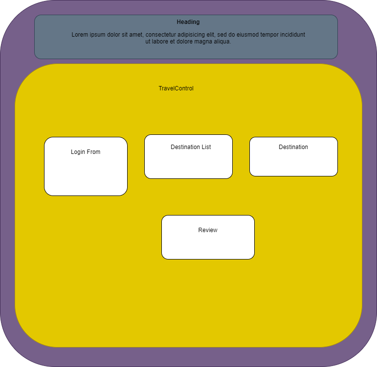

# Travel App 

#### By: Nitun Datta and Jozy Kinnaman
_July 20, 2020_

## Description

_ A React.js and Redux application that uses a queriable Api  that will allow the user to GET & POST reviews of their travel destinations and associated experiences._

### 

## Component Tree

### Website Template

## Setup/Installation Requirements

* Clone this repository from GitHub.
* Ensure that Node is installed on your computer
* In the project directory, run the 'npm install' command.
* run 'npm start'

## Specification
 

|                          Behavior                          | Input  | Output  |
| :--------------------------------------------------------: | :----: | :-----: |
| The user can view popular travel destinations | 'http://localhost:5000/{reviews}' | 'List of destinations' |
| The user can view all reviews about travel destinations | 'http://localhost:5000/{reviews}' | 'List of reviews' |

// once api call is made consider adding auth for user to post to API
| The user can POST reviews about travel destinations | 'http://localhost:5000/{country}{city}{review}' | 'Populate a review' |
| The user can view popular travel destinations | 'http://localhost:5000/{country}{city}{review}' | 'List of popular reviews' |
| The user Edit their travel reviews | 'http://localhost:5000/{country}{city}{review}{PUT}' | 'Edits review' |
| The user DELETE their travel reviews | 'http://localhost:5000/{country}{city}{review}{DELETE}' | 'Deletes review' |
| The user view a random selection of travel reviews | 'http://localhost:5000/{country}{city}{review}{RANDOM}' | 'List of random reviews' |

- Deploy API? []
- Deploy App to netlify []
- Authorizaation with firebase? []

### Known Bugs

No bugs have been identified at the time of this update.

## Support and Contact Information

 Please contact me with any suggestions or questions at nitun.2@gmail.com. Thank you for your input!  
  
## Technologies Used
  * Git
  * React
  * Redux
  * Thunk
  * API
  * Javascript
  * npm
  * Webpack
  * JSX
  * Html
  * CSS

### License
### This software is licensed under the MIT license.

### Copyright (c) 2020 Nitun Datta // Jozy Kinnaman
